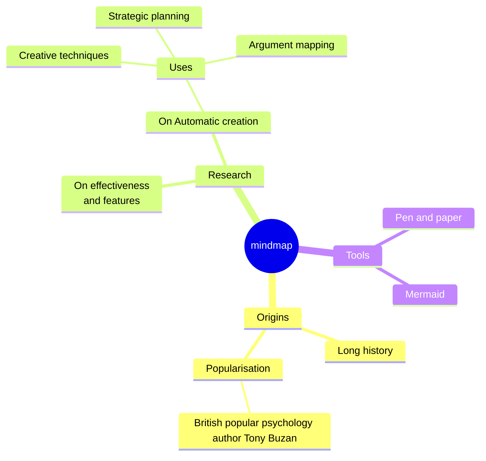

# 🚏 IoT-powered smart bus stop

**To improve the mobility of citizens in a city/metropolis, enabling fast, easy and safe travel, and at the same time, lower management costs for the administrators.**

## Abstract

This project has been made as the final project for the Master's Degree in CS IoT course. It focuses on improving public transportation, particularly through city buses. The aim is to create a smart bus stop, which allows easier access to the service and enables (through a network of such stations) an enhancement of the service.

In the project vision, each smart bus stop is going to be equipped with a digital kiosk/totem device and a button board. A solar panel could also be provided to the station to make it self-sufficient during sunny hours.

The totem would allow people to see the real-time location of public transportation, with any transit times through the various stations. It also makes it possible to purchase tickets on the spot, making it easy for people without a mobile device to reserve a seat and plan a trip.  
An NFC/RFID reader makes the auth possible both with the smartphone and with other physical devices (provided, for example, to the elderly who don't own modern mobile).

For people with disabilities, a button is provided to alert the driver to give help or attention.

Once the network of smart stops is established, it will be possible to perform statistical analysis and forecasting on the use of a certain line, allowing better allocation of resources (add/delete a bus, "dynamic" lines, etc). An ideal solution uses an AI-powered camera to count people waiting at the stops and a server that checks if the maximum capacity of the upcoming bus would be exceeded, so calling an additional bus.

The project has been developed on Arduino and Esp32 dev-board. Every part works smoothly but some parts have been simplified since more realistic solutions would have been too time-expensive.

## Actors and Architecture  

The main actors of the project are the *bus stop*, the *bus stop help button*, *the bus itself* and the *main server*.

### Main server

The main server manages a Flask server that offers frontends to the stops. It receives via MQTT from the buses and from the help buttons the data and it couples 

Il server offre via Flask un'interfaccia utente alle fermate, dalla quale gli utenti possono registrare sul database centrale la loro presenza su un certo bus, solo dopo essersi autenticati usando un sensore nfc e arduino collegato al front-end della singola fermata (usando una nuova funzione js). Il server riceve inoltre via mqtt da tutti i bus la loro posizione in tempo reale e la presenta agli utenti su una mappa interattiva, insieme all'attuale numero di persone presenti sul bus e al tempo stimato di arrivo (calcolato con le api OpenRouteService). Si contano inoltre usando un potenziometro le persone presenti sulle singole fermate e si evidenziano in una interfaccia per amministratori le fermate in cui ci sono troppe persone rispetto alla capienza massima dell'autobus che sta per arrivare lì. Infine in ogni singola fermata vi è un esp32 con un bottone per segnalare la presenza alla fermata di persone con bisogno di assistenza. Il server riceve la richiesta via mqtt e la manda all'autobus che sta per arrivare. Abbiamo poi aperto una API per le informazioni sulle fermate a potenziali clienti (sviluppatori). Abbiamo poi sviluppato (ma non ancora collegato in quanto i risultati sono ancora troppo naive) un algoritmo basato su Prophet della previsione dei tempi di percorrenza.

