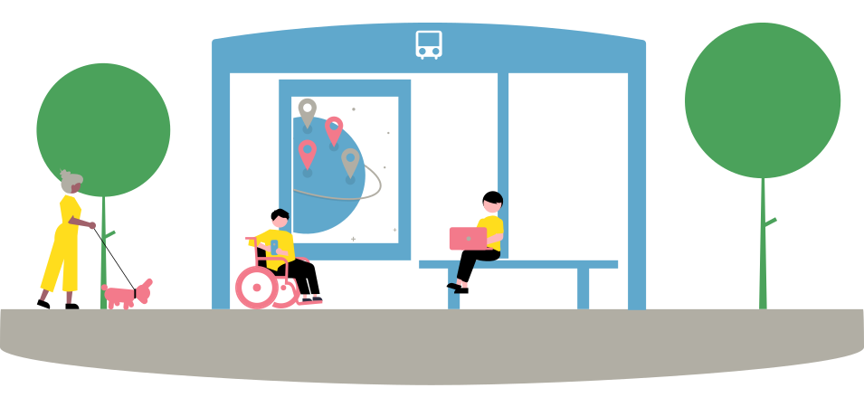
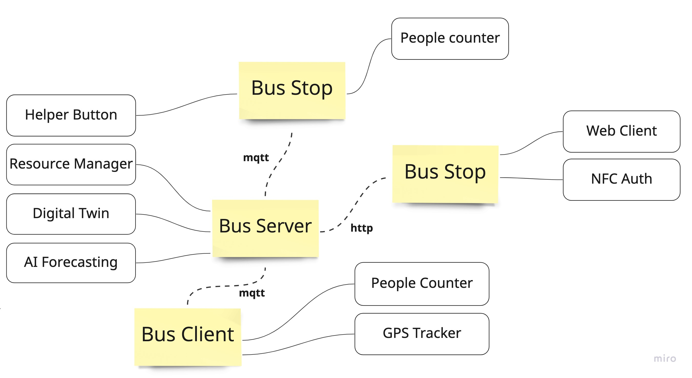

# 🚏 IoT-powered smart bus stop

**To improve city mobility, enabling faster, easier and safer public transport for the user and at the same time, lower management costs for the administrators.**

## 📝 Abstract  

This project has been developed as the final project for the Master's Degree in CS IoT course. It focuses on improving public transportation, particularly through city buses. The aim is to create a smart bus stop, which allows easier access to the service and enables (through a network of such stations) an enhancement of the service.

In the authors' project vision, each smart bus stop will be equipped with a digital kiosk/totem device and a button board. A solar panel could also be provided to the station to make it self-sufficient during sunny hours.

The totem would allow people to see the real-time locations of public services, along with the estimated transit times through the various stations. It also makes it possible to purchase tickets on the spot. An NFC/RFID reader makes the auth possible both with the smartphone and with other physical devices (provided, for example, to the elderly who don't own a modern mobile).

For people with disabilities, a button is provided to alert the bus driver to give help or attention.

Once the network of smart stops is established, it would be possible to perform statistical analysis and forecasting on the use of a certain line, allowing better allocation of resources (add/delete a bus, "dynamic" lines, etc). The project aims to reduce maintenance costs for public administrations. An ideal solution uses an AI-powered camera to count people waiting at the stops and a server that checks if the maximum capacity of the upcoming bus would be exceeded, so calling an additional bus.

The project has been developed on Arduino and Esp32 dev-board. Although all the parts work smoothly, some components have been simplified (eg omitting some security best practices) since more realistic solutions would have been too time-expensive.

**Authors**: Giacomo Salici [@jacksalici](https://github.com/jacksalici) and Francesco Marcucci [@MRTCc](https://github.com/MRTCc), University of Modena and Reggio Emilia

## 🏗 Actors and Architecture  

The main actors of the project are the *bus stop*, the *bus stop help button*, *the bus itself* and the *main server*.

|Actor|Component|Link|
|-|-|-|
|Main Server [(Overview)](#main-server-)|Flask Server|[Details and code](bus-server)|
||Prophet forecasting| [Details and code](forecasting_prophet)
Bus Stop [(Overview)](#bus-stop-)|Arduino|[Details and code](bus-station-nfc-reader)|
Bus Stop Help button [(Overview)](#bus-stop-help-button-)| Esp32 | [Details and code](bus-stop-button)
|Bus Client [(Overview)](#bus-client-)|GPS Tracker|[Details and code](bus-tracker-client)|

### Main server 🧠

The main server manages a **Flask server** [[code]](bus-server) that offers frontends to the stops. It is subscribed to all MQTT topics and it couples the information of each bus and its next stop. All the details, along with the seat bookings are stored in an SQLite database that represents a digital twin of public transport.

The server receives via MQTT the location of each bus and fetches using Open Route Service the ETA to its next station and sends all the data to it. It receives also the number of seats busy.

From each station, moreover, the server receives the number of people awaiting there and if someone requests help using the specific button. The request is forwarded via MQTT to the upcoming bus.

The count of the people in the crowd is presented to the system administrators on a specific page. Bus lines that can't manage all the people are highlighted.

For the developers, the server has an API endpoint that let to fetch real-time data from the stops such as the number of people there.

Lastly, we develop with Prophet a **forecasting model** [[code]](forecasting_prophet) to predict the number of people waiting in the stops in a future moment based on the past recorded data. Since it is just a demo project the recorded data was generated using a script, so the model is not accurate.

### Bus Stop 🚏

Each bus stop has a kiosk loaded on the server offered front-end. Users can use a real-time-updated map to see the location of the bus, along with the actual number of busy seats on that bus.

Users can book a seat by logging in using an NFC reader. An **Arduino board** [[code]](bus-station-nfc-reader) sends to the serial port the UID of the NFC tag (or smartphone). It is read on the front-end using the experimental web serial port API. Since the project is just a demo we used the UID as the authentication key ignoring that it would be a severe vulnerability in an actual realization.

### Bus Stop Help Button 🕹

Each stop is provided with an ESP32 board that let people toggle a button to call for help [[code]](bus-stop-button). The board is separated from the Arduino NFC reader for the sake of modularity and the decoupling principle.

The same ESP32 board read the value of a potentiometer that simulates the presence of an AI-powered camera that counts people.

### Bus Client 🚍  

Each bus is tracked with a GPS sensor. For the demo, we created a smartphone app [[code]](bus-tracker-client) that sends the location and that allows the user to set the number of busy seats and the next stop.

## 📺 Presentations

During the final presentation, we were asked to present a [commercial/marketing-oriented presentation](presentation-commercial.pdf) and a more [technical one](presentation-technical.pdf). Both are written in Italian.

## 💡 Acknowledgement
- [Smart Bus Stops as Interconnected Public Spaces for Increasing Social Inclusiveness and Quality of Life of Elder Users](https://www.mdpi.com/2624-6511/3/2/23)

- [The smart bus for a smart city — A real-time implementation](https://www.researchgate.net/publication/317640116_The_smart_bus_for_a_smart_city_-_A_real-time_implementation)

- [Developing a Smart Bus for Smart City using IOT Technology](https://ieeexplore.ieee.org/stamp/stamp.jsp?arnumber=8474819&casa_token=OZFhcjsChyMAAAAA:98dlm0OJxNweNn0mVezt-kvXV9SnH9zGMqn_mhkuFfDjq7OWWVDbTmLlN_yldPMKguQGxdvm4ZI)

Other useful links: 
- [https://troudigital.com/transport/smart-bus-stops-and-digital-bus-shelters/](https://troudigital.com/transport/smart-bus-stops-and-digital-bus-shelters/)
- [https://www.edmonton.ca/projects_plans/transit/smart-bus-initiative](https://www.edmonton.ca/projects_plans/transit/smart-bus-initiative)
- [https://extendedmonaco.com/en/project/smart-bus-shelters-a-clever-combination-of-infrastructure-and-digital-technology/](https://extendedmonaco.com/en/project/smart-bus-shelters-a-clever-combination-of-infrastructure-and-digital-technology/)
- [https://urban-digital.co.il/SmartBusStop.html](https://urban-digital.co.il/SmartBusStop.html)
- [https://oemkiosks.com/?page=smart-bus-shelters](https://oemkiosks.com/?page=smart-bus-shelters)
