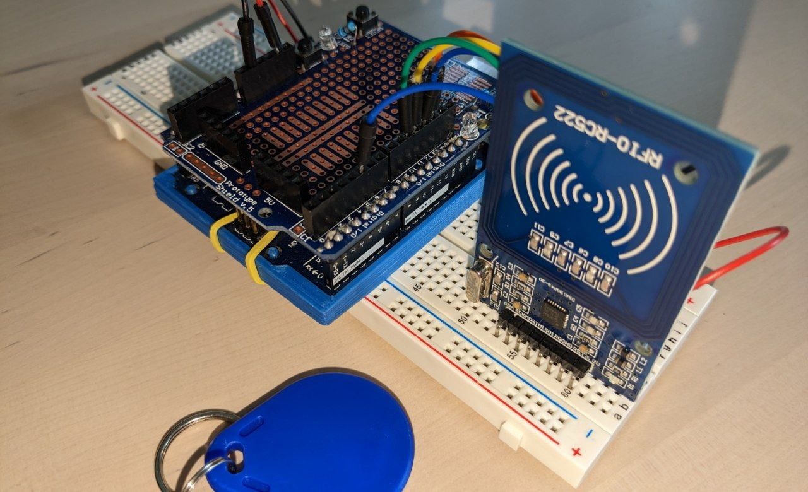

# Bus Stop NCF reader 🔐

Users can book a seat by logging in using an NFC reader. An **Arduino board** sends to the serial port the UID of the NFC tag (or smartphone).

> The UID of a card can not be used as an unique identification for security related projects. Some Chinese cards allow to change the UID which means you can easily clone a card. For projects like access control, door opener or payment systems you must implement an additional security mechanism like a password or normal key.  

However, for the sake of the presentation we used the UID both for the user id and for the key. Every time the RFID sensor reads a new card it sends to the Serial Port an 8 bytes buffer. The first 4 bytes are just `0xFF` and they are needed to synchronize the transmitter and the receiver, then the last 4 bytes are the 4-bytes-long UID.

|0xFF|0xFF|0xFF|0xFF|uid[0]|uid[1]|uid[2]|uid[3]|
|-|-|-|-|-|-|-|-|

## Acknowledgement and pin schematics 📚 

- [An Introduction to RFID - Ruthu S Sanketh](https://medium.com/autonomous-robotics/an-introduction-to-rfid-dc6228767691)

- [rfid/examples at master - miguelbalboa/rfid](https://github.com/miguelbalboa/rfid/tree/master/examples)
- [Read RFID Tag’s UID with RC522](https://www.diyengineers.com/2021/04/15/learn-how-to-read-an-rfid-tag-with-rc522-and-arduino/)

