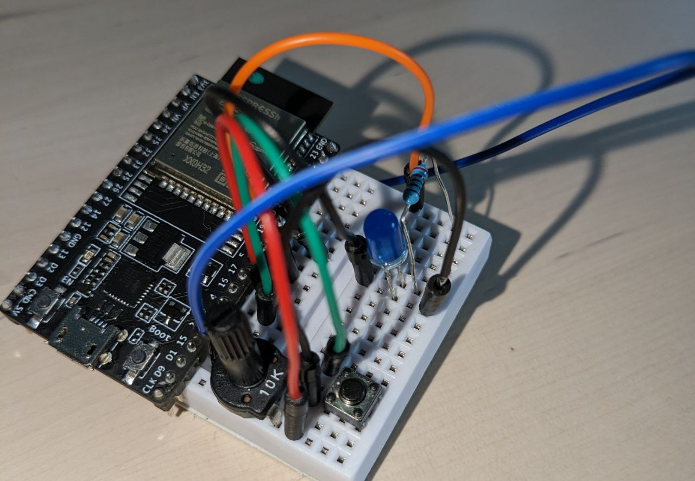
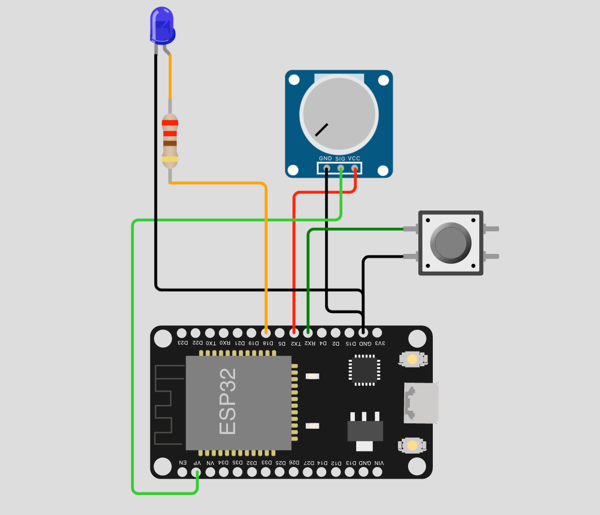

# Bus Stop Help Button 🕹




Each stop is provided with an ESP32 board that let people toggle a button to call for help. The board is separated from the Arduino NFC reader for the sake of modularity and the decoupling principle.
A led is present to ease the reading of the button state.

The same ESP32 board read the value of a potentiometer that simulates the presence of an AI-powered camera that counts people.

WifiManager allows creating a web portal for easy change of the configuration of the wifi and the MQTT broker params without hardcoding them, along with the ID of the single stop. We used HiveMq free plan. The parameters in these files may not be available in the future, we suggest changing them.

The data about the button and the crowd are published on specific topics:
|Topic|Payload|
|-|-|
`devices/fermate/<stopID>/contapersone/`|people counter|
`devices/hButtons/from/<stopID>/` | button state

The board is also subscribing the topic `devices/hButtons/to/<stopID>/` from the which is possible to switch on and off the help button.

3d printed case can be 3d printed in the future.


## Libraries used 📒

```c
#include <WiFiManager.h> 

#include <WiFi.h>
#include <WiFiClientSecure.h> //TLS support, need by HiveMq broker

#include "credential.h" //gitignored my wifi ssid and pw 

#include <PubSubClient.h> //MQTT 
```


## Pin schematic 📍



```c
#define BUTTON_PIN 16 
#define LED_PIN 18    
#define POTENTIOMETER_IN 36
#define POTENTIOMETER_OUT 17

pinMode(BUTTON_PIN, INPUT_PULLUP); 
pinMode(LED_PIN, OUTPUT);          
pinMode(POTENTIOMETER_IN, INPUT_PULLUP);
pinMode(POTENTIOMETER_OUT, OUTPUT);

digitalWrite(POTENTIOMETER_OUT, HIGH);
```